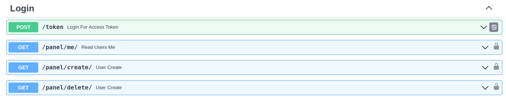
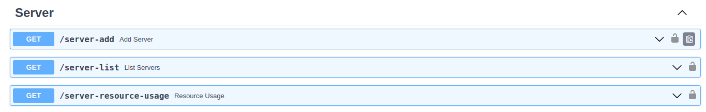

# SSH Tunnel With API

SSH tunnel dynamic is a method of creating a secure connection between two computers over an unsecured network. It involves using the SSH protocol to create a tunnel through which data can be transmitted securely.

In this case, a Python backend with FastAPI is used to control the SSH tunnel dynamic. The backend is connected to a MongoDB database for storage and retrieval of data.

Overall, this setup provides a secure and efficient way to transmit data over an unsecured network while also allowing for easy control and management through the use of Python and FastAPI.

## Installation

There are two ways to install and run this project: 
First You can pull the project and install the Python requirements, then run the API using uvicorn. 

```bash
uvicorn --host <your-hostname> --port <your-port> api:app 
```

Alternatively, you can use the pre-built image of this project that is available in my Dockerhub.


```bash
https://hub.docker.com/u/officialalikhani
```

For Pull and run docker image you can use this command after install docker:
```bash
docker run -it -e ENVMONGOPASS=<your-db-password> -e ENVPORT=<your-api-port> -e ENVUSER=<your username> -e ENVPASS=<your password> -p <container-port>:<your-api-port> officialalikhani/ssh_api:latest

```
The login API is a crucial part of our application that allows users to authenticate and gain access to their accounts. It follows a secure and efficient process to ensure user privacy and data protection.

To initiate the login process, users need to send a POST request to the `/token` endpoint with their credentials, including their username and password, in the request body. The API then verifies these credentials against our user database.

If the provided credentials are valid, the API generates a JSON Web Token (JWT) as a response. This token serves as an authentication token for subsequent requests made by the user. It contains encrypted information about the user's identity and permissions.

To maintain security, we use industry-standard techniques like password hashing and salting during credential verification. This ensures that even if our database is compromised, user passwords remain protected.

In case of invalid credentials or any other errors during login, appropriate error messages are returned to guide users on how to resolve the issue.


Here's an example explanation of an API that allows users to add, delete, and get a list of servers ,The Server Management API is a RESTful web service that provides functionality for managing servers. It allows users to add new servers, delete existing servers, and retrieve a list of all available servers.

1. Add a Server:
   - Endpoint: GET /server-add
   - Description: This endpoint allows users to add a new server to the system.
   - Response: Upon successful addition, the API will respond with a success message.
   - 
2. Get List of Servers:
   - Endpoint: GET /server-list
   - Description: This endpoint retrieves a list of all available servers in the system.
   - Response: The API will respond with an array containing details of each server
   - 
3. Get List of Servers:
   - Endpoint: GET /server-resource-usage
   - Description: This endpoint retrieves a list of all usage like cpu ,memory ,disk and network speed server in the system.
   - Response: The API will respond with an array containing details of server

